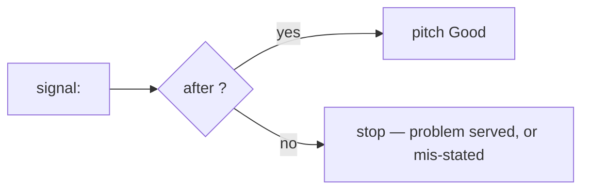
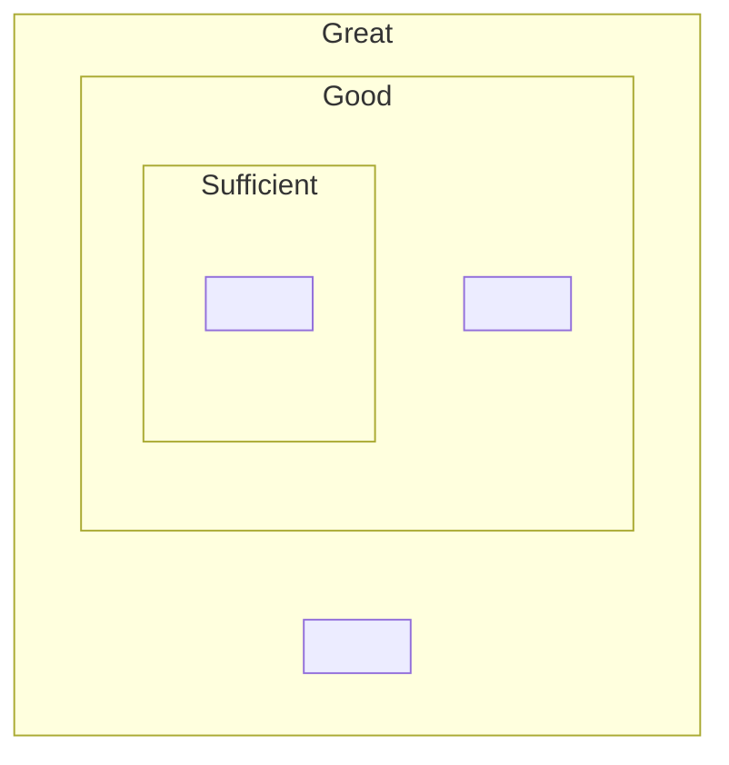

# Shape doc template

Write to `.context/shape-<slug>.md`. Every section below appears in the output, in one of three states:

- **transcribed** — filled from decisions the user made in session
- **drafted** — filled from code evidence, prefixed `⚠️ drafted from code — verify`
- **scaffolded** — left as the italic prompt for a human, marked `_(human — fill before betting table)_`

The template, with per-section state and diagram form:

```markdown
# <Title> — shape

| | |
|---|---|
| Owner | _(human — fill before betting table)_ |
| Status | DRAFT |
| Target Quarter | _(human — fill before betting table)_ |
| Stakeholders | _(human — fill before betting table)_ |
| Appetite | <as stated at intake — the only time expression in the doc> |

## ⁉️ Problem

<Short narrative — the sharpened problem statement, the benefit to customer/tenant/business.
The one prose-led section.>

### What this is not

<One line per rejected option: the option, and what its elimination taught about the problem.
Evidence about the problem — never merged into risks.>

## ✅ Success criteria

<Terse list: how we will know the objective has been met.>

## 🧐 Insights

<Per slice, a Mermaid decision fork — signal → threshold → invest/stop:>

### Sufficient — <the problem-validation question>



### Good — <investment question> …
### Great — <investment question>

<Great's yes-branch feeds a future pitch for further investment in this area — beyond this
work package; its no-branch is "stop — the area is served.">


## 🪜 In scope

<Lead with the slice ladder — one diagram, each level annotated with its deploy point
and its Insights question:>



<Then per slice: a coarse breadboard delta (what this level adds), a terse feature list,
and the instrumentation events that belong to this slice's scope.>

Scope not reached in the cycle returns to the betting table as a fresh pitch; it never rolls over.

## ⚱️ Out of scope

<Terse list of no-gos — deliberate exclusions from the chosen solution.>

## 💡 Solution overview

<Context/seam diagram of the systems touched, from recon. A sequence diagram wherever a
flow crosses a service boundary. Coarse on purpose.>

## 🥘 Appetite

<The appetite and who works on it. Per-slice fit expressed in unknowns, not days:
"Sufficient: 0 open, 2 patched — high confidence.">

## ⚠️ Delivery risks — unknowns register

| Unknown | Fate | Evidence / patch | Ladder placement |
|---|---|---|---|
| <unknown> | Resolved / Patched / Open | <what the code showed, or the declared patch> | <slice> |

<Include every unverified assumption here — sibling repos, external services, third-party APIs.>

## 🫂 Audience

_(human — fill before betting table)_

## 📝 Approval and Feedback

_(human — fill before betting table)_

## 📍 Jira

_(human — link epic both ways before betting table)_

## Solution Assessment

| Area | Assessment | Links |
|---|---|---|
| Dependencies | ⚠️ drafted from code — verify: <findings> | |
| Test plan | ⚠️ drafted from code — verify: <findings> | |
| Conduct or Regulatory impact | _(human — Advice SME)_ | |
| Privacy impact | _(human)_ | |
| Data impact | ⚠️ drafted from code — verify: <findings> | |
| Calcs impact | _(human)_ | |
| Architecture impact | ⚠️ drafted from code — verify: <findings> | |
| Design System impact | _(human)_ | |
| Security impact | ⚠️ drafted from code — verify: <findings> | |
| Performance impact | ⚠️ drafted from code — verify: <findings> | |
| Cost impact | ⚠️ drafted from code — verify: <findings> | |
| Tenant impact | _(human)_ | |

## ♻️ Build Complete

_(post-build retro — leave empty at shaping time: application standards, changes to scope,
discovered work, changes to solution, changes to impact, known issues, tech debt)_
```
